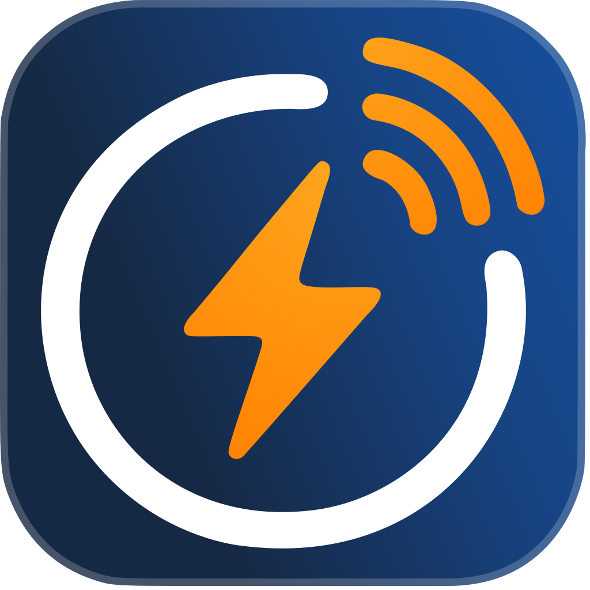
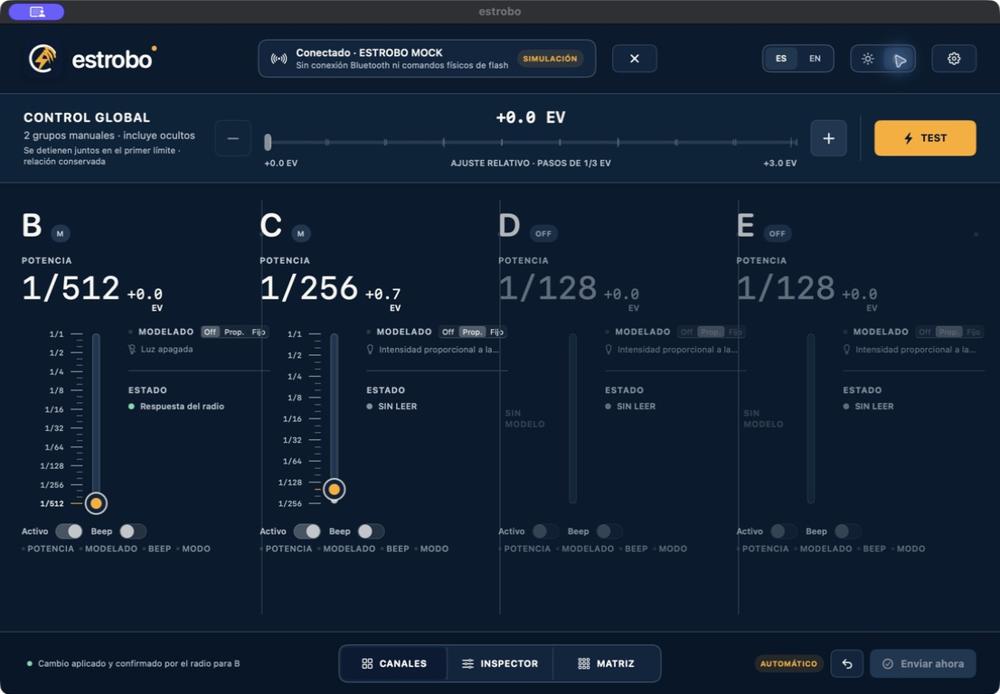
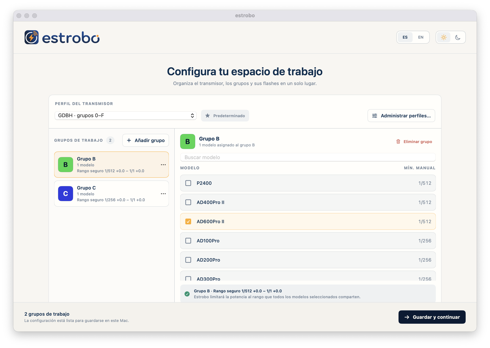

<p align="center">
  
</p>

<h1 align="center">estrobo</h1>

<p align="center"><strong>Control local y nativo desde macOS para disparadores de flash Godox compatibles con Bluetooth.</strong></p>

<p align="center"><sub>macOS 13+ &nbsp;·&nbsp; Apple Silicon + Intel &nbsp;·&nbsp; Todo permanece local</sub></p>

<p align="center"><a href="README.md">English</a> &nbsp;·&nbsp; <strong>Español</strong></p>

Estrobo reúne los controles de disparadores de flash Godox compatibles en un espacio de trabajo enfocado para Mac. Organiza grupos y ajusta potencia, modo, luz de modelado y controles globales sin cuenta, backend, analítica ni telemetría.

> [!WARNING]
> Esta primera beta pública no está firmada con Apple Developer ID ni notarizada por Apple. Usa una firma autosignada únicamente para conservar su identidad entre builds beta, por lo que macOS bloqueará el primer inicio con una advertencia de Gatekeeper.



## Requisitos

- macOS 13.0 o posterior.
- Mac con Apple Silicon (`arm64`) o Intel (`x86_64`).
- Bluetooth disponible y permiso concedido a Estrobo.
- Un disparador de flash Godox compatible, con Bluetooth integrado y activado, que exponga el perfil BLE/GATT observado por Estrobo. La cobertura física todavía es limitada; consulta [Beta y compatibilidad](docs/BETA.md).
- Conexión exclusiva: cierra antes cualquier app móvil o de escritorio conectada al transmisor. El radio sólo admite una conexión Bluetooth a la vez.

## Estado de compatibilidad

Estrobo se conecta por Bluetooth a un disparador de flash Godox compatible. No se conecta directamente a los flashes ni a los receptores: esos dispositivos continúan comunicándose mediante el sistema de radio Godox del propio disparador y no necesitan Bluetooth.

El Bluetooth integrado debe estar activado, pero tener Bluetooth no garantiza por sí solo la compatibilidad. El disparador debe exponer el perfil BLE/GATT de Godox Flash compatible con Estrobo y el soporte puede variar según modelo y firmware. Un nombre Godox, anuncio BLE o UUID no demuestra compatibilidad.

### Configuración probada físicamente

| Conexión | Hardware probado |
| --- | --- |
| Mac ↔ disparador por Bluetooth | Godox X3Pro con Bluetooth activado |
| Disparador ↔ flashes | Godox AD400Pro II |

Esta es la única matriz de hardware utilizada en pruebas físicas hasta ahora; no se registraron la variante exacta de cámara ni las revisiones de firmware, y no todas las funciones se han validado ópticamente. Otros disparadores con Bluetooth que expongan el perfil BLE/GATT de Godox Flash compatible, y otros flashes del sistema Godox X controlados mediante el disparador, también podrían ser compatibles, pero Estrobo no declara soporte hasta verificar físicamente cada combinación de disparador, flash y firmware.

## Instalar esta beta

1. Descarga `estrobo-<tag>-macos-universal.zip`, `SHA256SUMS` y `estrobo-<tag>-manifest.json` desde [GitHub Releases](https://github.com/loomitz/estrobo/releases). Conserva los tres archivos juntos en Descargas y no uses builds publicados en issues ni enlaces de terceros.
2. Abre Terminal y verifica los archivos del release antes de extraerlos:

   ```sh
   cd ~/Downloads
   shasum -a 256 -c SHA256SUMS
   ```

   Continúa únicamente si tanto el ZIP como el manifiesto muestran `OK`.
3. Descomprime el ZIP y mueve `estrobo.app` a Aplicaciones.
4. Haz doble clic en Estrobo una vez. Como esta beta no tiene firma Apple Developer ID ni notarización, macOS bloqueará el primer inicio.
5. Ve a **menú Apple → Configuración del Sistema → Privacidad y seguridad**, baja a **Seguridad**, pulsa **Abrir de todos modos**, autentícate y confirma **Abrir**. Apple mantiene ese botón disponible por un tiempo limitado después del primer intento. Consulta el [procedimiento oficial de Apple](https://support.apple.com/guide/mac-help/mh40617/mac).

La advertencia es esperada, pero no prueba que cualquier archivo sea seguro: verifica siempre el checksum y el origen del release. No desactives Gatekeeper, retires la cuarentena ni marques manualmente como confiable la autofirma del proyecto.

## Inicio rápido

1. Enciende el transmisor y cierra cualquier otra app conectada a él.
2. Abre Estrobo y configura el perfil, los grupos de trabajo y al menos un modelo de flash por grupo.
3. Pulsa **Buscar**. Elige el radio usando nombre, RSSI y el sufijo de UUID; nombre y UUID ayudan a distinguirlo, pero no lo autentican criptográficamente.
4. Introduce el **Código del radio** de seis dígitos. Es el PIN local de compatibilidad y proximidad del transmisor, no una credencial fuerte ni un secreto de alto valor. No reutilices un PIN personal.
5. La opción para recordarlo comienza apagada. Si la activas, Estrobo lo guarda localmente y sin cifrar sólo después de completar `PWOK` y la sincronización; nunca lo envía a Internet. **Olvidar** elimina radio y código guardados.
6. El handshake BLE sigue siendo obligatorio. Una vez completado, Estrobo actúa como fuente de verdad y sobrescribe deliberadamente el estado global A0 y los A1 de todos los grupos configurados. No importa el estado previo del transmisor.
7. En **Automático**, un cambio se envía 700 ms después del último ajuste. Un arrastre no transmite valores intermedios: el plazo comienza al soltar. También puedes elegir **Con botón** y usar **Enviar ahora** o **Descartar**.

Lee [Sincronización automática](docs/AUTOMATIC-SYNC.md) antes de conectar hardware.

## Modo simulado

Para explorar la interfaz sin crear una sesión Bluetooth ni enviar comandos físicos:

```sh
/usr/bin/open -n /Applications/estrobo.app --args --mock-radio
```

Desde un checkout de desarrollo:

```sh
make mac-prototype-build
/usr/bin/open -n prototype/GodoxMacControlPrototype/Build/estrobo.app --args --mock-radio
```

La app muestra **Radio simulado** de forma explícita. Nunca activa este modo como fallback silencioso.

## Qué incluye

- Grupos `0–9` y `A–F` según el perfil; potencia Manual en pasos Godox de 1/3 EV y rango común seguro por modelos asignados.
- M y Auto/TTL, Off, modelado apagado/proporcional/fijo, Beep global, Standby global y Test explícito.
- Ajuste de potencia global con relación entre grupos conservada.
- Vistas Canales, Inspector y Matriz; presets locales; español e inglés; apariencia clara y oscura.
- Entrega automática con debounce de 700 ms o modo **Con botón**.
- Recuperación fail-closed cuando el resultado de una escritura queda incierto.

<details>
<summary><strong>Ver configuración del espacio de trabajo</strong></summary>



</details>

## Límites importantes

- No existe lectura completa radio → app. **Sync no importa valores: los sobrescribe.**
- `FEC8` no identifica el grupo, no devuelve los valores y no demuestra el resultado óptico.
- Test confirma como máximo la entrega a CoreBluetooth; la persona debe observar el destello.
- La edición Multi no está disponible en esta beta. Tampoco están disponibles el cambio de canal, la compensación TTL no neutra, el cambio de código, firmware u OAD.
- La compatibilidad física varía por transmisor, flash y firmware. Un nombre BLE o UUID no demuestra el modelo ni la autenticidad del radio.

## Planeado

El modo Multi está planeado para una versión futura. La cobertura de compatibilidad también crecerá conforme se validen físicamente más combinaciones de disparador, flash y firmware.

## Documentación y comunidad

- [Cómo funciona](docs/HOW-IT-WORKS.md)
- [Conexión Bluetooth](docs/BLUETOOTH-CONNECTION.md)
- [Sincronización automática](docs/AUTOMATIC-SYNC.md)
- [Beta, instalación y riesgos](docs/BETA.md)
- [Solución de problemas](docs/TROUBLESHOOTING.md)
- [Privacidad](PRIVACY.md)
- [Seguridad](SECURITY.md)
- [Soporte](SUPPORT.md)
- [Contribuir](CONTRIBUTING.md)
- [Historial de cambios](CHANGELOG.md)
- [Avisos de terceros](THIRD-PARTY-NOTICES.md)

Estrobo es un proyecto independiente. No está afiliado, patrocinado, aprobado ni mantenido oficialmente por Godox. Godox y los nombres de sus productos pertenecen a sus respectivos titulares.

Este repositorio no incluye una licencia open-source. La ausencia de licencia es intencional por ahora.
