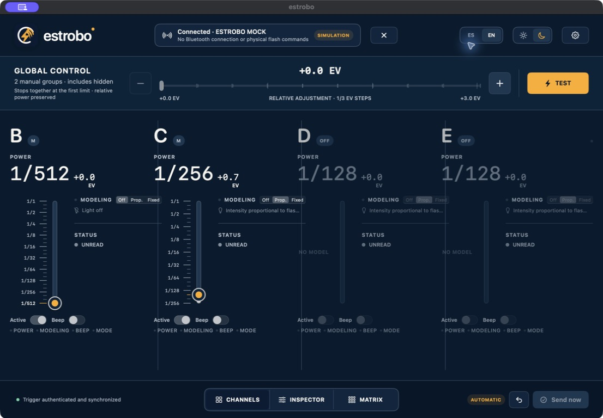
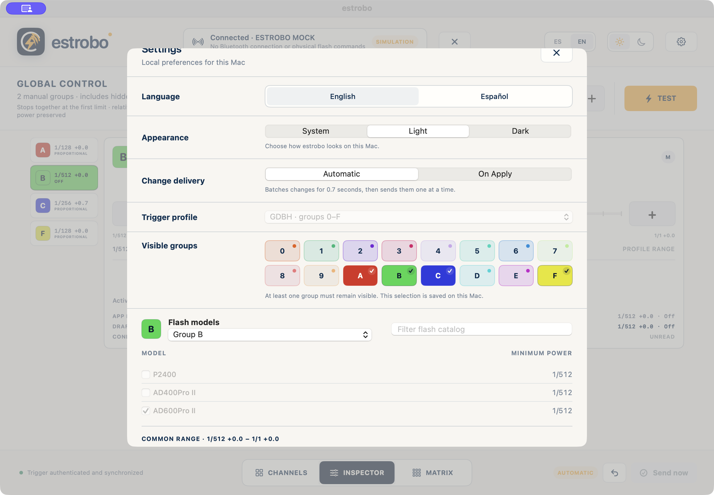

<p align="center">
  
</p>

<h1 align="center">estrobo</h1>

<p align="center"><strong>Local, native macOS control for compatible Bluetooth-enabled Godox flash triggers.</strong></p>

<p align="center"><sub>macOS 13+ &nbsp;·&nbsp; Apple Silicon + Intel &nbsp;·&nbsp; Local-only</sub></p>

<p align="center"><strong>English</strong> &nbsp;·&nbsp; <a href="README.es.md">Español</a></p>

Estrobo brings compatible Godox flash-trigger controls into one focused Mac workspace. Organize working groups and adjust power, mode, modeling light, and global controls without an account, backend, analytics, or telemetry.

> [!WARNING]
> This first public beta is not signed with Apple Developer ID and is not notarized by Apple. It is self-signed only to keep its identity consistent between beta builds, so macOS will block the first launch with a Gatekeeper warning.



## Requirements

- macOS 13.0 or later.
- A Mac with Apple Silicon (`arm64`) or Intel (`x86_64`).
- Bluetooth available and permission granted to Estrobo.
- A compatible Godox flash trigger with built-in Bluetooth enabled and the BLE/GATT profile observed by Estrobo. Physical coverage is still limited; see [Beta and compatibility](docs/BETA.md).
- An exclusive connection: first close any mobile or desktop app connected to the transmitter. The radio supports only one Bluetooth connection at a time.

## Compatibility status

Estrobo connects over Bluetooth to a compatible Godox flash trigger. It does not connect directly to flashes or receivers: those devices continue to communicate through the trigger's own Godox radio system and do not need Bluetooth.

Built-in Bluetooth must be turned on, but Bluetooth alone does not guarantee compatibility. The trigger must expose the Godox Flash BLE/GATT profile supported by Estrobo, and support can vary by model and firmware. A Godox name, BLE advertisement, or UUID is not proof of compatibility.

### Physically tested setup

| Connection | Tested hardware |
| --- | --- |
| Mac ↔ Bluetooth trigger | Godox X3Pro with Bluetooth enabled |
| Trigger ↔ flash units | Godox AD400Pro II |

This is the only hardware matrix used for physical testing so far; the exact camera variant and firmware revisions were not recorded, and not every feature has been optically validated. Other Bluetooth-enabled triggers exposing the supported Godox Flash BLE/GATT profile, and other Godox X-system flashes controlled through the trigger, may also be compatible, but Estrobo does not claim support until each trigger, flash, and firmware combination is physically verified.

## Install this beta

1. Download `estrobo-<tag>-macos-universal.zip`, `SHA256SUMS`, and `estrobo-<tag>-manifest.json` from [GitHub Releases](https://github.com/loomitz/estrobo/releases). Keep the three files together in Downloads and do not use builds from issues or third-party links.
2. Open Terminal and verify the release files before extracting them:

   ```sh
   cd ~/Downloads
   shasum -a 256 -c SHA256SUMS
   ```

   Continue only if the ZIP and manifest both report `OK`.
3. Extract the ZIP and move `estrobo.app` to Applications.
4. Double-click Estrobo once. Because this beta has no Apple Developer ID signature or notarization, macOS will block its first launch.
5. Go to **Apple menu → System Settings → Privacy & Security**, scroll down to **Security**, click **Open Anyway**, authenticate, and confirm **Open**. Apple keeps this button available for a limited time after the first launch attempt. See [Apple's official procedure](https://support.apple.com/guide/mac-help/mh40617/mac).

The warning is expected, but it does not prove that every file is safe. Always verify the checksum and release source. Do not disable Gatekeeper, remove the quarantine attribute, or manually trust the project's self-signed certificate.

## Quick start

1. Turn on the transmitter and close any other app connected to it.
2. Open Estrobo and configure the profile, working groups, and at least one flash model per group.
3. Click **Find**. Choose the trigger using its name, RSSI, and UUID suffix; the name and UUID help distinguish it but do not authenticate it cryptographically.
4. Enter the six-digit **Radio Code**. It is the transmitter's local compatibility/proximity PIN, not a strong credential or a high-value secret. Do not reuse a personal PIN.
5. The option to remember it starts off. If enabled, Estrobo stores it locally and unencrypted only after completing `PWOK` and synchronization; it never sends it over the Internet. **Forget** removes the saved radio and code.
6. The BLE handshake is still required. Once it completes, Estrobo acts as the source of truth and deliberately overwrites global A0 and every configured group's A1. The transmitter's previous state does not matter.
7. In **Automatic**, a change is sent 700 ms after the last adjustment. Dragging does not transmit intermediate values: the delay starts when you release the control. You can also choose **On Apply** and use **Send now** or **Discard**.

Read [Automatic synchronization](docs/AUTOMATIC-SYNC.md) before connecting hardware.

## Simulated mode

To explore the interface without creating a Bluetooth session or sending physical commands:

```sh
/usr/bin/open -n /Applications/estrobo.app --args --mock-radio
```

From a development checkout:

```sh
make mac-prototype-build
/usr/bin/open -n prototype/GodoxMacControlPrototype/Build/estrobo.app --args --mock-radio
```

The app displays **Simulated radio** explicitly. It never enables this mode as a silent fallback.

## What is included

- Groups `0–9` and `A–F`, depending on the profile; Manual power in 1/3 EV Godox steps and a safe common range for the models assigned to each group.
- M and Auto/TTL, Off, modeling light off/proportional/fixed, global Beep, global Standby, and explicit Test.
- Global power adjustment that preserves the relationship between groups.
- Channels, Inspector, and Matrix views; local presets; Spanish and English; light and dark appearance.
- Automatic delivery with a 700 ms debounce or **On Apply** mode.
- Fail-closed recovery when the outcome of a write is uncertain.

<details>
<summary><strong>See workspace configuration</strong></summary>



</details>

## Important limitations

- There is no complete radio → app readback. **Sync does not import values; it overwrites them.**
- `FEC8` does not identify the group, return values, or prove the optical result.
- Test confirms at most delivery to CoreBluetooth; a person must observe the flash.
- Multi editing is not available in this beta. Channel changes, non-neutral TTL compensation, Radio Code changes, firmware, and OAD are also unavailable.
- Physical compatibility varies by transmitter, flash, and firmware. A BLE name or UUID does not prove the radio's model or authenticity.

## Planned

Multi mode is planned for a future release. Compatibility coverage will also expand as more trigger, flash, and firmware combinations are physically validated.

## Documentation and community

- [How it works](docs/HOW-IT-WORKS.md)
- [Bluetooth connection](docs/BLUETOOTH-CONNECTION.md)
- [Automatic synchronization](docs/AUTOMATIC-SYNC.md)
- [Beta, installation, and risks](docs/BETA.md)
- [Troubleshooting](docs/TROUBLESHOOTING.md)
- [Privacy](PRIVACY.md)
- [Security](SECURITY.md)
- [Support](SUPPORT.md)
- [Contributing](CONTRIBUTING.md)
- [Changelog](CHANGELOG.md)
- [Third-party notices](THIRD-PARTY-NOTICES.md)

Estrobo is an independent project. It is not affiliated with, sponsored, endorsed, or officially maintained by Godox. Godox and its product names belong to their respective owners.

This repository does not include an open-source license. The absence of a license is intentional for now.
