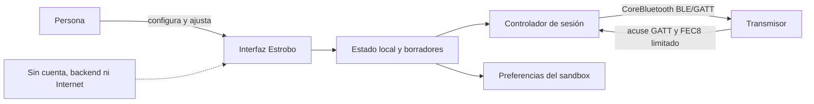

# Cómo funciona Estrobo

Estrobo es una aplicación SwiftUI/AppKit que actúa como central BLE mediante CoreBluetooth. La app conserva el estado deseado, construye tramas del protocolo observado y las entrega directamente al transmisor. No existe cuenta, backend, acceso a Internet, analítica ni telemetría.

## Modelo mental

El transmisor no ofrece una lectura completa que permita reconstruir su estado. Por eso la flecha importante va de Estrobo al radio: el estado local es la fuente de verdad.

## Ciclo de una sesión

1. **Preparar el espacio de trabajo.** En la primera apertura no hay grupos preseleccionados: la persona elige explícitamente la compatibilidad del transmisor, sus grupos de trabajo y uno o más modelos de flash por grupo. El rango manual disponible es la intersección segura de esos modelos.
2. **Buscar y seleccionar.** Estrobo muestra nombre BLE, RSSI y un sufijo corto del UUID. Prioriza el UUID recordado. Si hay nombres duplicados no elige uno arbitrariamente.
3. **Preparar BLE.** CoreBluetooth conecta, descubre `FFF0`/`FEC0`, localiza `FFF1`, `FFF4`, `FEC7` y `FEC8`, y activa notificaciones o indicaciones.
4. **Validar el Código del radio.** Un reto local `Psub` viaja por BLE y la app valida temporalmente una respuesta `PWOK`. No interviene una cuenta ni un servicio remoto. El código no constituye autenticación fuerte.
5. **Sincronizar.** Estrobo envía el Sync técnico y después sobrescribe A0 y cada A1 configurado. La secuencia no lee ni importa el estado previo.
6. **Editar.** Las tres vistas comparten los mismos borradores. Un cambio discreto se programa para envío o queda pendiente según el modo elegido.
7. **Confirmar o recuperar.** A0 requiere acuse GATT; cada A1 requiere acuse GATT y después una respuesta `FEC8`. Un resultado incierto bloquea nuevas escrituras hasta reconectar el mismo radio, reenviar el A0 seguro y todos los A1 originales de la escena, y confirmarlos en ese orden.

El detalle del enlace está en [Conexión Bluetooth](BLUETOOTH-CONNECTION.md) y la semántica de sobrescritura en [Sincronización automática](AUTOMATIC-SYNC.md).

## Estado global A0 y grupos A1

- **A0** es una instantánea global. Estrobo la usa para Beep master, Standby y Multi: gate de activación, potencia compartida efectiva, número de destellos y Hz.
- **A1** es una instantánea completa por grupo: modo M/TTL/Multi/Off, potencia manual de referencia, intensidad de modelado, Beep subordinado, modo de modelado y compensación. Al entrar a Multi desde M conserva la potencia Manual guardada; si el origen era TTL usa `0x32`. La potencia efectiva de la ráfaga siempre proviene de A0, no de ese byte A1.
- **Multi usa A0 global y una escena A1 exclusiva limitada al workspace.** El botón **MULTI** junto a Beep es la única vía para activar o desactivar el gate y muestra la consola inline mientras está activo; no abre menú. Al entrar convierte atómicamente todos los grupos activos compatibles a Multi y conserva Off a los no participantes, que aparecen desactivados en la interfaz. Los controles de participación agregan o quitan grupos, pero no pueden quitar el último ni apagar el gate. Al pulsar de nuevo el botón global, Estrobo desactiva A0 Multi y convierte todos los grupos de trabajo a Manual activo; no restaura sus modos M/TTL/Off previos.
- En una sincronización completa se escribe **A0 primero** y después un **A1 por cada grupo de trabajo**, en orden y sin solapar escrituras.
- Los grupos ocultos siguen siendo parte del espacio de trabajo y de la sincronización; ocultar sólo cambia la presentación.
- Los grupos que no pertenecen al espacio de trabajo no reciben A1 al entrar, editar ni salir de Multi. A0 sigue siendo global por definición.

Una confirmación de transporte no equivale a una medición física. En particular, `FEC8` sólo contiene un prefijo A1 utilizable para avanzar la cola; no identifica grupo, no devuelve el cuerpo aplicado y no confirma luz o destello.

## Entrega de cambios

**Automático** es el valor predeterminado. Espera 700 ms desde el último cambio y reúne el A0 Multi y los grupos pendientes en una sola tanda serial. **Con botón** conserva los borradores hasta pulsar **Enviar ahora**. Ambos modos usan el mismo validador y escriben A0 antes de cualquier A1 que dependa de él.

Los controles continuos abren una transacción interactiva con token. Mientras el puntero sigue presionado:

- la UI y los borradores cambian en vivo;
- no se arma ni ejecuta el plazo automático;
- Apply/Enviar ahora, Sync, Test y acciones que sustituyen o transmiten el borrador quedan bloqueados en todas las ventanas;
- Desconectar permanece disponible.

Al finalizar el último token se arma una sola vez el debounce de 700 ms y sólo puede transmitirse el valor final. Teclado, VoiceOver, botones y toggles siguen siendo cambios discretos normales. Si el control desaparece, se deshabilita o la sesión se cancela, la vista libera su token.

## Controles disponibles

- Potencia Manual en pasos de 1/3 EV (`.0`, `.3`, `.7`) dentro del rango común de los flashes asignados.
- M, Auto/TTL y Off se eligen por grupo. Multi se activa y desactiva únicamente con el botón **MULTI** junto a Beep; no depende de dropdown, menú ni selector de modo por grupo. Mientras está activo, la consola ofrece potencia, destellos, Hz y participación `A–E`; los participantes muestran **MULTI · GLOBAL** y los excluidos aparecen desactivados. Al apagar Multi, todos los grupos del workspace quedan activos en Manual.
- La potencia Multi se limita al rango común de los flashes asignados, usa pasos completos y nunca supera `1/4`. El dominio base es `1–100` destellos y `1–100 Hz`; el techo efectivo del conteo puede ser menor según potencia, frecuencia y modelos participantes. La UI calcula `destellos ÷ Hz` como exposición mínima orientativa y la redondea siempre hacia arriba a milésimas de segundo.
- AD400Pro II es el único modelo con filas de límite Multi potencia × frecuencia publicadas e implementadas. Estrobo las usa para reducir el rango de conteo y normalizar un borrador que exceda el nuevo techo. El manual omite `51–59 Hz`; en ese tramo se aplica de forma conservadora la fila `60–100 Hz` y la consola lo identifica como **no publicado**, nunca como verificado. Ningún otro modelo hereda esa tabla: la consola muestra **límite pendiente de validar**, o **límite verificado parcial** cuando conviven modelos con y sin perfil verificado. Un cambio de modelos no puede descartar ni disparar un conteo que haya quedado fuera del nuevo límite. HSS está excluido de Multi.
- Luz de modelado apagada, proporcional o fija entre 10% y 100%; la cobertura óptica fuera de los puntos observados sigue siendo limitada.
- Ajuste global relativo de potencia hasta ±3 EV sin romper la relación entre grupos.
- Beep como una sola decisión A0 + A1; Standby como cambio A0-only.
- Test explícito por `FFF1`; nunca se dispara durante conexión, Sync, restauración o carga de preset. En Multi puede iniciar una ráfaga y Bluetooth no confirma el número de destellos real.
- Presets nombrados que guardan valores de grupo y el ajuste Multi global, no UUID ni Código del radio.

## Datos locales

La app guarda dentro de su sandbox el espacio de trabajo, presets y preferencias de interfaz/entrega. El journal de recuperación contiene el UUID, el A0 anterior y los A1 originales de toda la tanda, nunca el Código del radio. La recuperación reenvía y confirma primero A0 y después cada A1; el journal sólo se elimina al completar la escena. Recordar el radio es opt-in: sólo entonces se guardan localmente y sin cifrar nombre, UUID y código. Consulta [Privacidad](../PRIVACY.md).

El bundle público usa `mx.loo.estrobo`. El cambio desde el identificador de prototipo crea una identidad limpia de preferencias antes de incorporar participantes públicos; la app no migra automáticamente los datos del prototipo.

## Modo simulado y pruebas

`--mock-radio` inyecta un transporte determinista dentro del proceso. No crea un central CoreBluetooth ni habla con hardware. El mismo controlador recorre búsqueda, `PWOK`, Sync, A0/A1, cambios y fallos simulados.

Las pruebas verifican bytes/CRC, A0 Multi antes de A1, cambios A0-only, cola serial, timeouts, recuperación, persistencia, la tabla potencia × frecuencia del AD400Pro II y el comportamiento de interacción. También fijan que el botón Multi sea la única vía de encendido/apagado, que los no participantes queden visualmente desactivados y que apagar Multi devuelva todos los grupos a Manual. El harness AppKit/SwiftUI genera mouse-down, pausa, drag y mouse-up para comprobar que mantener presionado más de 700 ms no transmite valores intermedios. Las pruebas deterministas y la tabla del fabricante no sustituyen los gates ópticos manuales descritos en [Checklist de release](RELEASE-CHECKLIST.md).

## Límites de diseño intencionales

- Sin lectura completa radio → app.
- Sin cuenta o backend.
- Sin cambio de Código del radio, omisión del handshake `Psub`/`PWOK`, criptografía casera, edición de firmware u OAD.
- Sin reintento automático de Test.
- Sin afirmaciones de autenticidad basadas sólo en nombre BLE, RSSI o UUID.
